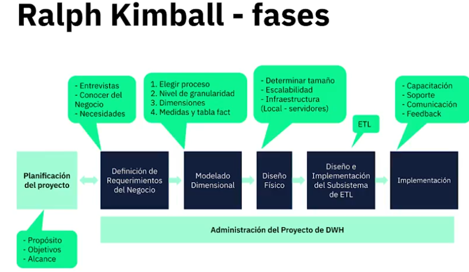

# Curso de Datawarehousing y modelado OLAP  
## 1. Que es BI y DataWarehousing  
BI: Ayuda a tomar las mejores decisiones. A traves de los datos los transformarmos para llegar a administrar el conocimiento.  
DataWarehousing: Tomar todos los datos que tenemos disponibles y relacionarlos entre si.  

## 2. Niveles de Analitica  
- Analítica Descriptiva: Examina datos históricos para entender eventos pasados y su impacto en el negocio.
- Analítica Diagnóstica: Investiga las causas de eventos específicos, identificando patrones y relaciones.
- Analítica Predictiva: Utiliza modelos estadísticos y algoritmos para prever futuros eventos y tendencias.
- Analítica Prescriptiva: Proporciona recomendaciones basadas en análisis previos para optimizar decisiones y acciones futuras.  

## 3. DataWarehouse, DataMart, Dimensiones y Hechos  
El data warehouse es una base de datos que contiene toda la informacion de distintas fuentes relacionados entre si.  

El Datamart por su parte, es un segmento del datawarehouse el cual sirve para una informacion de un area en particular.  

Las dimensiones por su parte ayudan a analizar la informacion para tener diferentes KPIS.  

Los hechos por su parte es la informacion cuantitativa de un negocio.  

## 4. OLTP vs OLAP  
OLTP son los procesamientos de transacciones en linea. Almacenan la informacion de forma rapida. Se puede ver como un diagrama entidad relacion.  

OLAP por su lado, ayuda a centralizar la informacion del hecho en si, toma los datos de toda la fuente y los lleva a un solo repositorio para ser mas facil de consultar y resumir. Su modelo es completamente dimensional.  

## 5. Metodologias

- Bill Inmon:  
  
- Ralph Kimball:  
  
  
- Hefesto:  
  
- Modelo personalizado:  
  

## 6. DataWarehouse, DataLake y DataLakeHouse: Cual utilizar  
- Data Warehouse:  
  
- Data Lake:  
  
- Warehouse vs Lake:  
  
- LakeHouse:  
  

## 7. Esquemas dimensionales  
Los modelos dimensionales tienen metricas y atributos. Los atributos estan relacionados a las dimensiones por las cuales queremos calcular dichas metricas.  
Se componen de una tabla de hechos en conjunto con las dimensiones al rededor. 
   
Se puede representar como un cubo:  
  
### 7.1. Modelo Estrella:  
Relacion directa entre los hechos y las dimensiones.  
  
### 7.2. Modelo Copo de Nieve:  
Relacion de dimensiones con otras dimensiones  
  
  
## 8. Dimensiones lentamente cambiantes:  
Las dimensiones resuelven los diferentes actores del proceso del negocio:  
- Que
- Quien
- Como
- Donde
- Cuando  
  
Existen distintos tipos de dimensiones, estas son de tipo jerarquicas o netamente descriptivos. Tambien existen atributos de control que realizan auditoria sobre los datos.  
  
Las dimensiones SDC (Slowly Dimensions Changing) tienen varios tipos.  
1. Tipo 1: Sobreescriben el atributo actualizado.  
En el proceso de crear esta actualizacion, deben tenerse en cuenta registros de auditoria que permitan crear trazabilidad para cuando existe un cambio
2. Tipo 2: Agrega un nuevo registro con el cambio.  
Existe un cambio en la dimension y se agrega este mismo a la dimension filtrada por una fecha de inicio y una fecha de fin, donde se pone el end_date con 31/12/9999 para que sea indeterminado.
3. Tipo 3: Agrega un nuevo atributo llamado "anterior".  
Basicamente esta agrega una nueva columna.  

## 9. Ejercicios en Pentaho  
Los ejercicios de este repositorio estan en la carpeta Transformation del repositorio.  
Lo cargado corresponde al archivo trn_clientes.ktr. Este tipo de archivos se pueden cargar en pentaho, el cual nos muestra el ETL de la siguiente manera:  
  